# Инструкция по работе с программой для анализа новостей

## Цель программы

Программа позволяет автоматически собирать, анализировать и систематизировать новости из различных источников по заданным вами темам, экономя время на мониторинге информации.

## 1. Регистрация и вход

Перед использованием программы необходимо создать учётную запись.

На странице нажмите кнопку «Регистрация» или «Вход», если аккаунт уже создан.

### Регистрация

Заполните регистрационную форму.

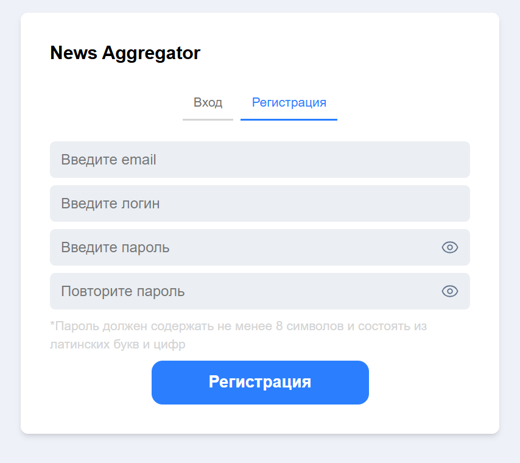

- Электронная почта (Email): введите действующий адрес.
- Логин: придумайте уникальное имя пользователя для входа в систему (размер логина 3-64 символа).
- Пароль: создайте надёжный пароль (минимальная длина - 8 символов).
- Подтверждение пароля: введите пароль ещё раз.

Нажмите кнопку «Регистрация».

Введите код, отправленный на указанную вами электронную почту.

Нажмите кнопку «Отправить».

### Вход

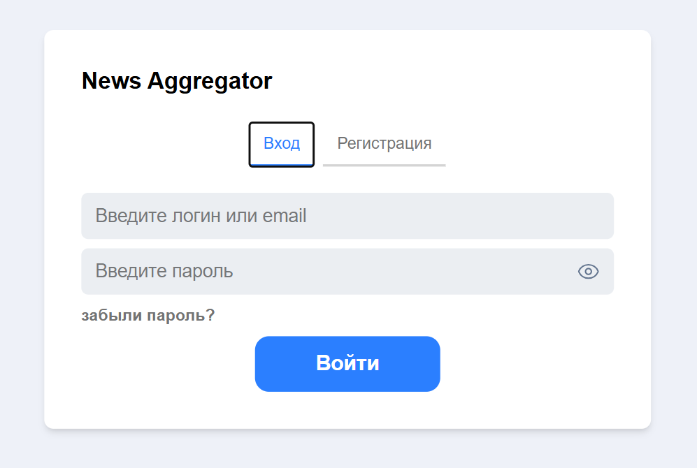

Введите ваш логин или e-mail.

Введите ваш пароль.

### Если вы забыли пароль

1. Нажмите кнопку «Забыли пароль» на странице входа.

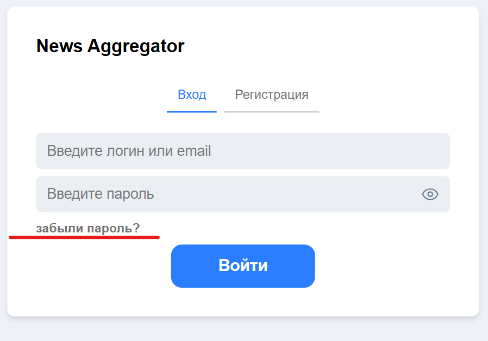

2. В появившемся поле введите ваш e-mail и нажмите кнопку «Отправить».
3. Затем заполните новую форму.

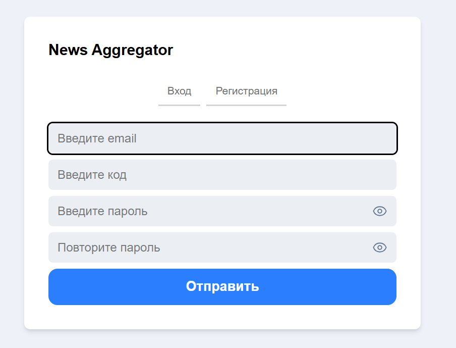

- Введите e-mail.
- Введите код, присланный вам на почту.
- Введите новый пароль.
- Повторите новый пароль.

## 2. Основное меню

Для перехода по вкладкам используйте основное меню, которое расположено в левом верхнем углу на всех основных вкладках.

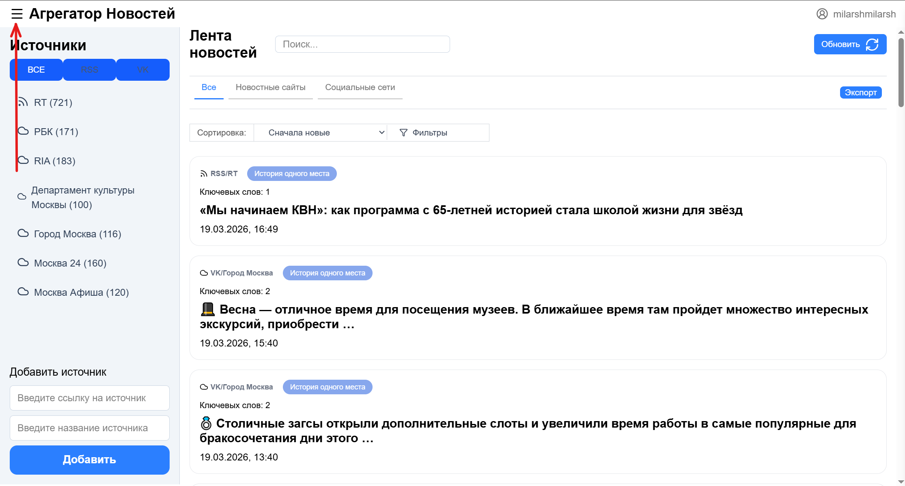

Нажмите на значок меню и выберите из списка нужную вкладку:

1. Главная (текущая вкладка)
2. Настройки
3. Ключевые слова
4. Стоп-слова
5. Управление источниками

## 3. Главная страница

После успешного входа вы попадёте на главный экран.

### Основная панель: лента новостей

Последние собранные статьи отображаются в ленте новостей.

На карточке каждой новости содержатся её источник, количество ключевых слов, найденных в ней, заголовок, дата и время публикации. Если у новости есть рубрика или она находится в тренде, на карточке есть соответствующие пометки.

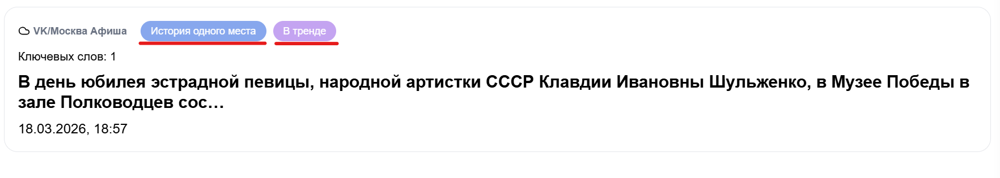

При нажатии на заголовок новости можно перейти на отдельную страницу этой статьи.

### Панель «Фильтры»

Для настройки фильтров нажмите на кнопку «Фильтры», расположенную над лентой новостей.

Справа появится панель с фильтрами со следующими разделами:

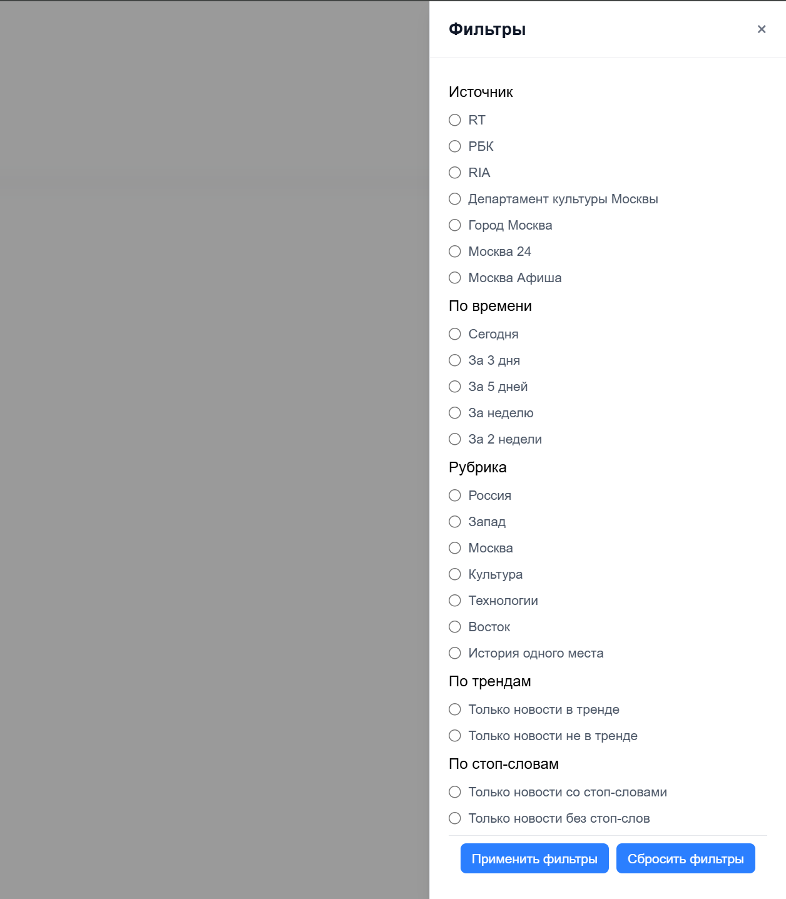

1. По источникам
2. По времени:
    - Сегодня
    - За 3 дня
    - За 5 дней
    - За неделю
    - За 2 недели
3. По рубрике
4. По трендам:
    - Только новости в тренде
    - Только новости не в тренде
5. По стоп-словам:
    - Только новости со стоп-словами
    - Только новости без стоп-слов

Для применения выбранных фильтров внизу панели нажмите кнопку «Применить». Чтобы сбросить фильтры, нажмите расположенную рядом кнопку «Сбросить фильтры». Чтобы закрыть панель, нажмите на крестик, расположенный в правом верхнем углу.

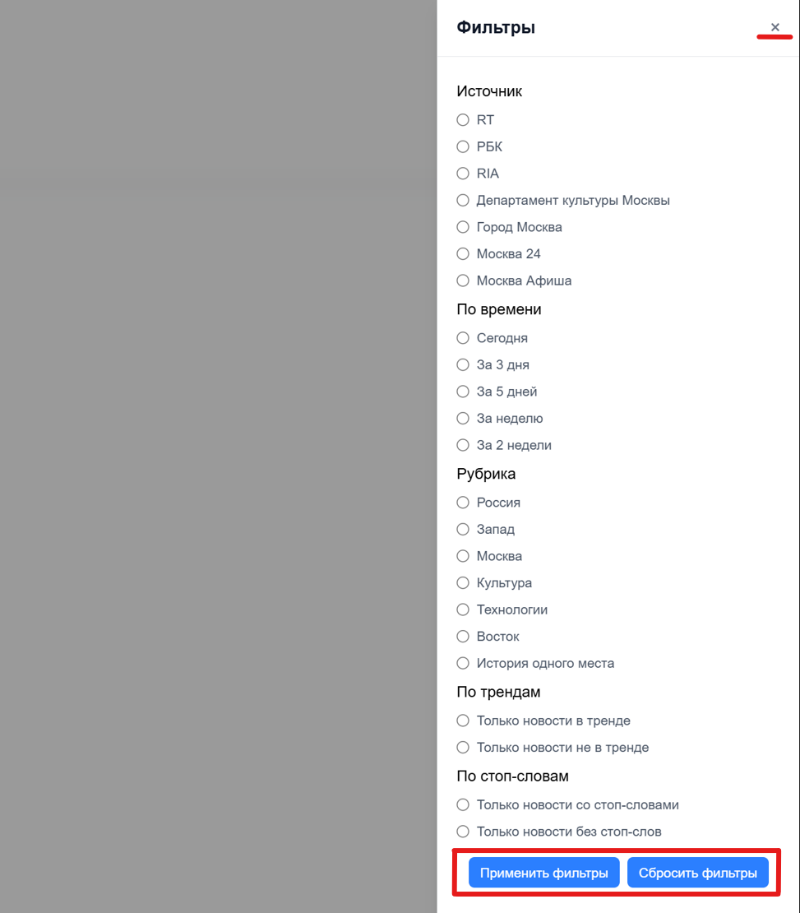

### Сортировка

Чтобы отсортировать новости, нажмите на кнопку, расположенную слева от кнопки «Фильтры» (по умолчанию там стоит «Сначала новые»).

Появится выпадающий список.

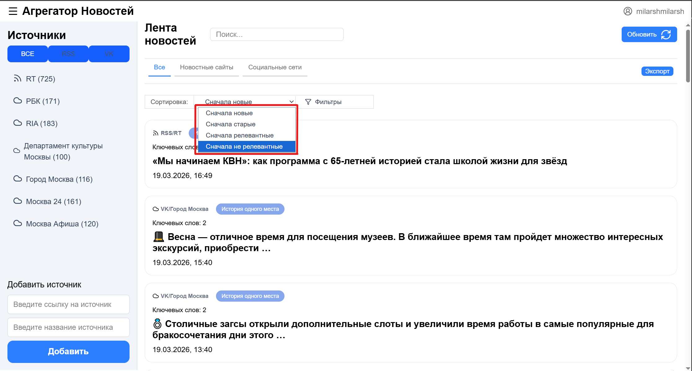

Выберите один из предложенных вариантов.

### Левая панель

Здесь перечислены все добавленные источники с возможностью отфильтровать их по типу источника при нажатии на кнопки «ВСЕ», «RSS», «VK».

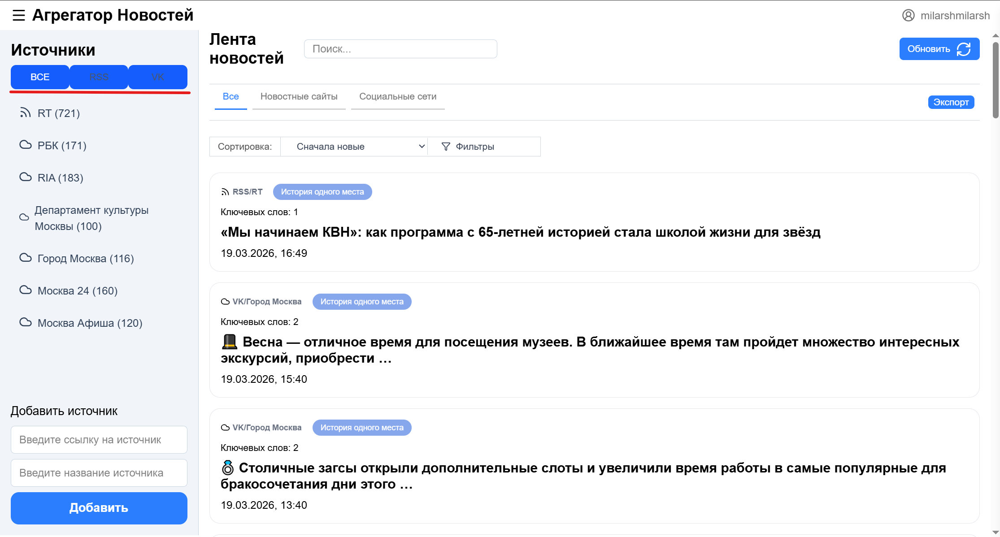

Снизу расположена форма для добавления нового источника.

#### Добавление источника

1. Введите ссылку на источник: для новостных сайтов используйте RSS-ссылку, для Telegram - ссылку на Telegram-канал.
2. Введите название источника.
3. Нажмите кнопку «Отправить».

#### Получение RSS-ссылки на источник на примере ТАСС

1. Зайдите на сайт [https://tass.ru/](https://tass.ru/).
2. Пролистните главную страницу вниз до конца.
3. Над заголовком «Разделы» расположена гиперссылка «RSS-лента».
4. Скопируйте её.

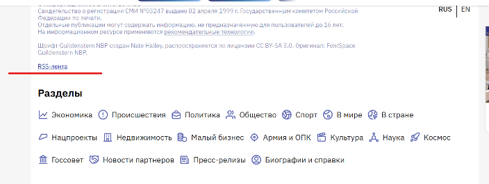

### Верхняя панель

На верхней панели расположены следующие элементы управления:

- Строка поиска: позволяет находить новости по ключевым словам.

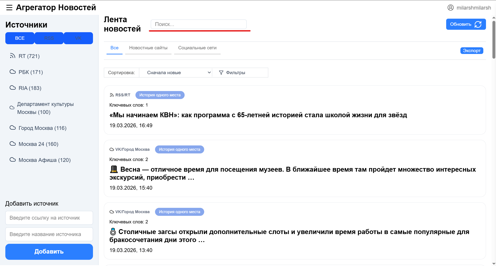

- Кнопка «Обновить»: загружает свежие материалы.

- Кнопка «Экспорт»: скачивает архив с медиафайлами и Excel-таблицей, содержащей статистику по новостям.

Справа на верхней панели находится ваше имя пользователя. Нажмите на него, чтобы перейти в профиль.

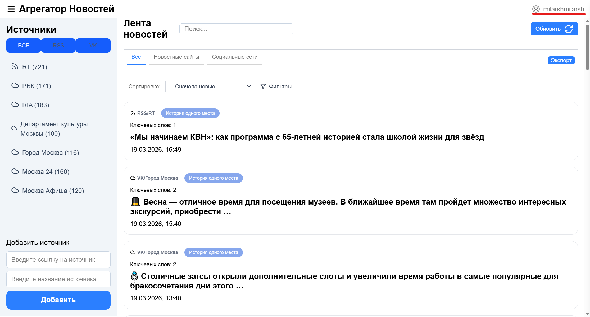

## 4. Отдельная страница каждой новости

Страница содержит текст новости, количество ключевых слов, стоп-слов и список ключевых слов, содержащихся в этой новости. При нажатии на кнопку «Читать далее» открывается полный текст новости. Чтобы перейти на оригинальную статью, нажмите кнопку «Перейти к оригиналу».

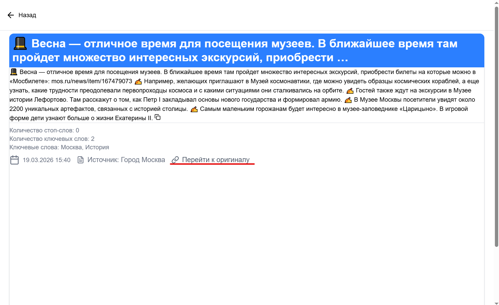

Для копирования текста новости нажмите кнопку буфера обмена, расположенную рядом с текстом новости.

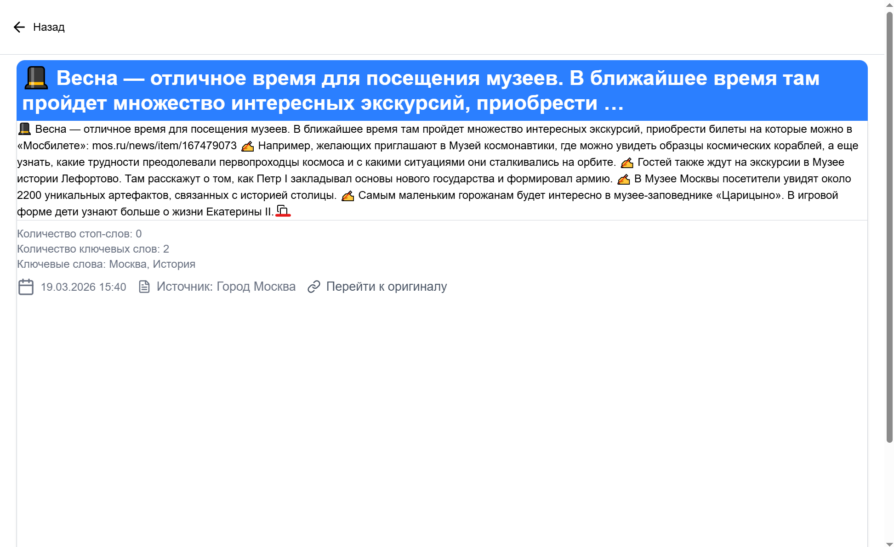

Для перехода назад на главную страницу нажмите кнопку «Назад», расположенную справа на верхней панели.

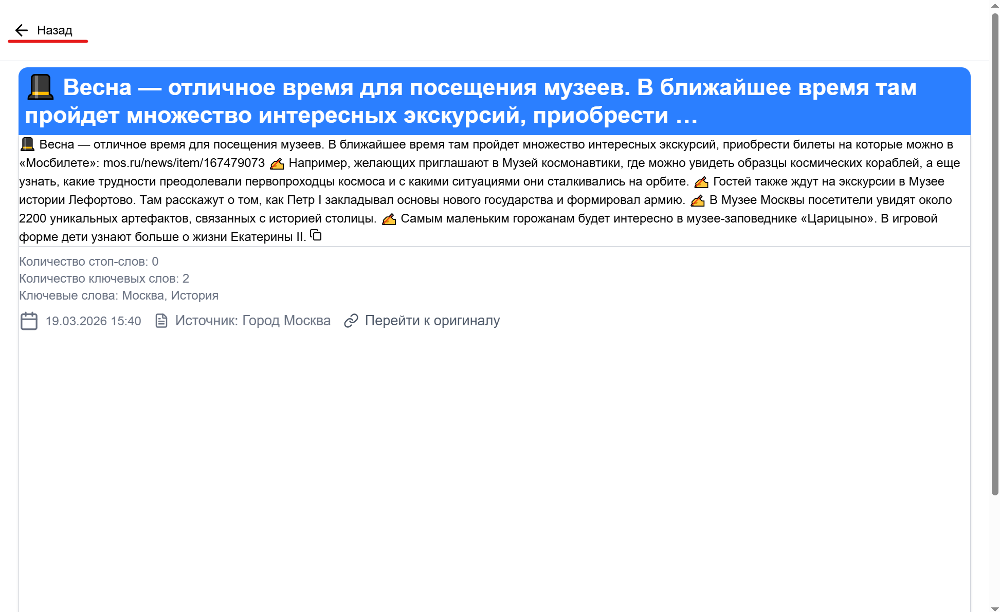

## 5. Вкладка «Настройки»

Вкладка содержит 5 разделов.

1. Очистка новостей: чтобы удалить все новости, введите в поле дату, до которой все новости должны быть удалены. После выбора даты появится статистика, содержащая информацию о текущем количестве новостей, сколько новостей будет удалено и сколько останется после удаления. Для удаления нажмите кнопку «Удалить».

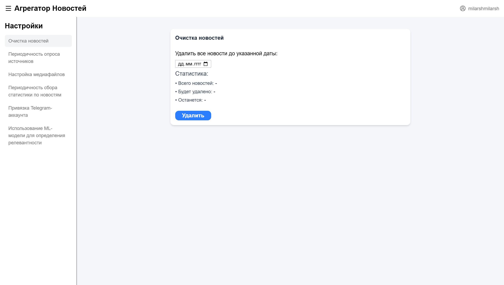

2. Периодичность опроса источников: чтобы настроить периодичность сбора новых новостей из источников, выберите один из предложенных вариантов:
    - 5 минут
    - 10 минут
    - 15 минут
    - 30 минут
    - 45 минут
    - 60 минут

    Или настройте частоту опроса вручную: в пустом поле укажите количество минут, через которые запросы к источникам должны повторяться.

    Чтобы сохранить изменения, нажмите кнопку «Сохранить».

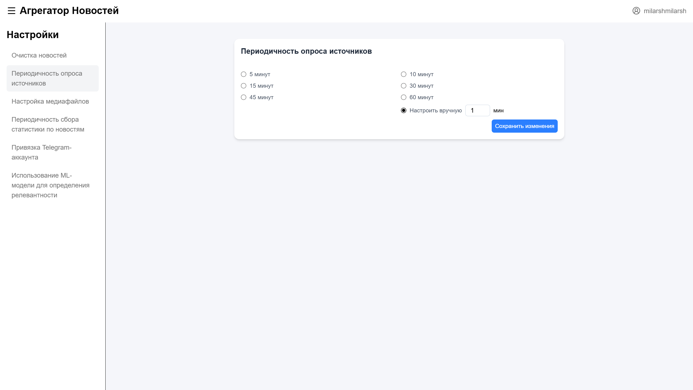

3. Настройка медиафайлов: чтобы включить функцию сохранения медиафайлов из новостей, перетащите ползунок, расположенный сверху, вправо; чтобы выключить - влево.

    Затем настройте максимальный объём медиафайла. Выберите один из доступных вариантов:
    - 5 МБ
    - 10 МБ
    - 25 МБ
    - 50 МБ
    - 100 МБ
    - 0 МБ

    Или настройте вручную: в пустое поле для ввода укажите максимальное количество МБ, доступное для сохранения медиафайла.

    Чтобы сохранить изменения, нажмите кнопку «Сохранить».

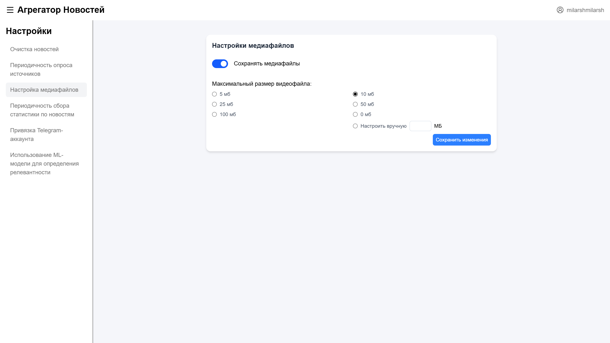

4. Периодичность сбора статистики по новостям: чтобы настроить периодичность сбора статистики по новостям, выберите один из предложенных вариантов:
    - 10 минут
    - 15 минут
    - 30 минут
    - 60 минут
    - 120 минут
    - 240 минут

    Или настройте частоту сбора вручную: в пустом поле укажите количество минут, через которые запросы к источникам должны повторяться.

    Чтобы сохранить изменения, нажмите кнопку «Сохранить».

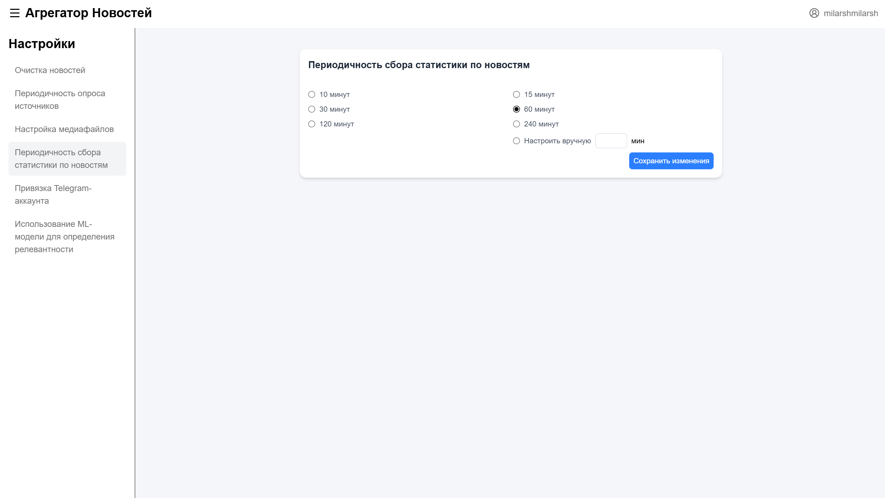

5. Использование ML-модели для определения релевантности.

Чтобы релевантность новости определялась с помощью ML-модели, перетащите ползунок вправо. Если хотите, чтобы релевантность определялась с помощью лемматизации, перетащите его влево.

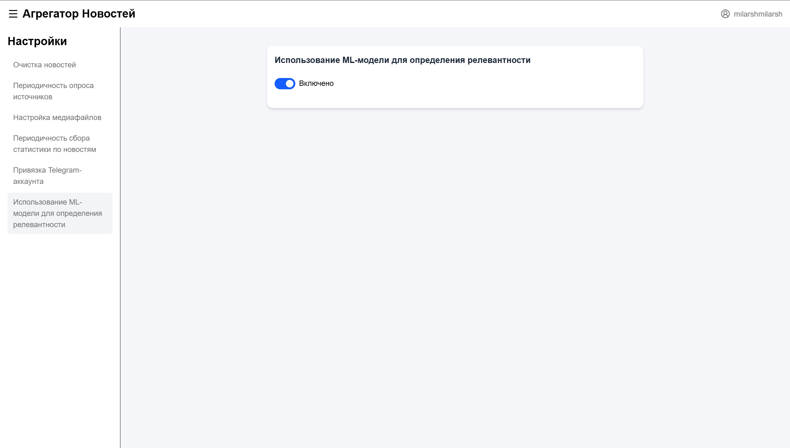

## 6. Вкладка «Ключевые слова»

### Боковая панель: статистика

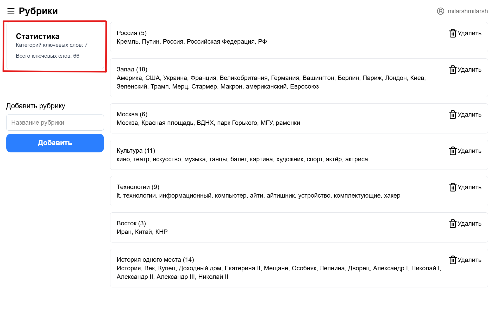

Раздел «Категорий ключевых слов» показывает, сколько у вас категорий для ключевых слов.

Раздел «Всего ключевых слов» показывает общее количество слов и фраз во всех категориях.

### Нижний блок: создание новой рубрики ключевых слов

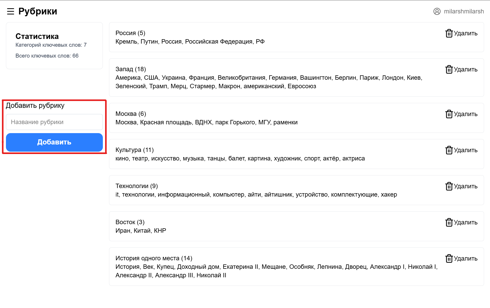

- Поле «Название рубрики» — для ввода имени новой группы ключевых слов.
- Кнопка «Добавить» — создаёт новую пустую категорию с введённым названием.

### Центральная панель

Содержит ленту со всеми категориями ключевых слов.

Каждый виджет категории содержит название категории. В скобках указано количество ключевых слов внутри неё. Под названием через запятую перечислены слова этой категории.

Рядом со списком слов находится кнопка «Удалить» — она удаляет всю категорию целиком.

Для перехода на страницу рубрики нажмите на название нужной категории.

### Отдельная вкладка категории ключевых слов

#### Боковая панель

Статистика содержит количество ключевых слов в данной категории.

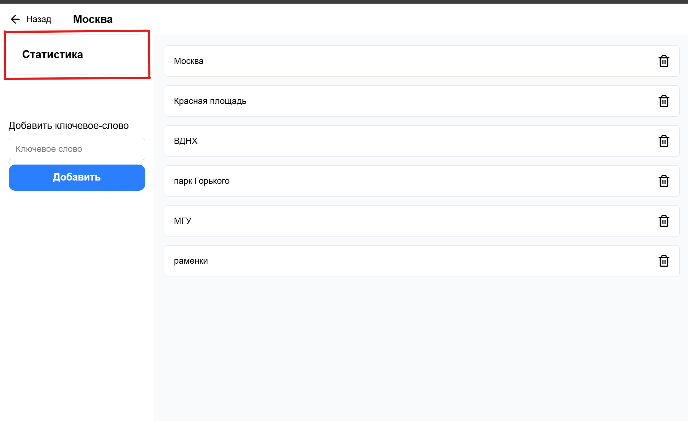

#### Нижний блок: добавление нового ключевого слова

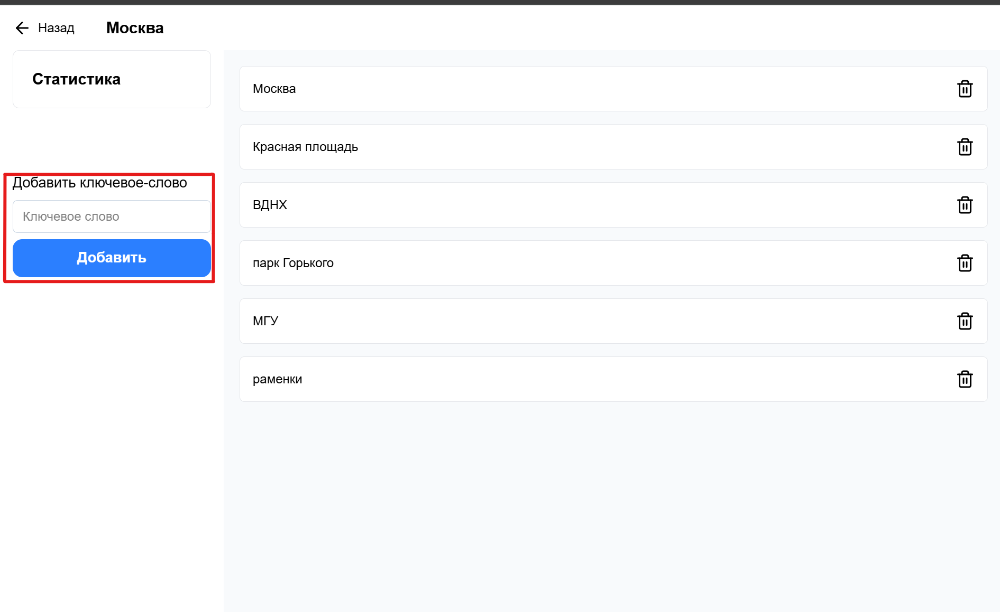

- Поле «Ключевое слово» — для ввода нового слова.
- Кнопка «Добавить» — добавляет в данную категорию новое слово.

#### Центральная панель

Содержит ленту со всеми ключевыми словами.

Напротив имени каждого слова есть кнопка для его удаления.

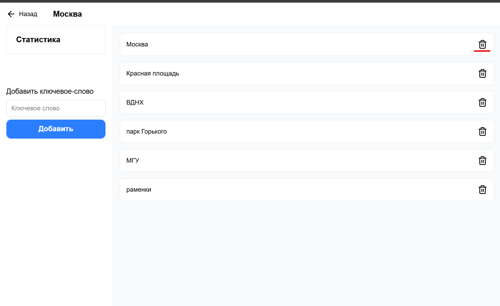

Для возвращения на вкладку «Ключевые слова» нажмите кнопку «Назад», расположенную слева на верхней панели.

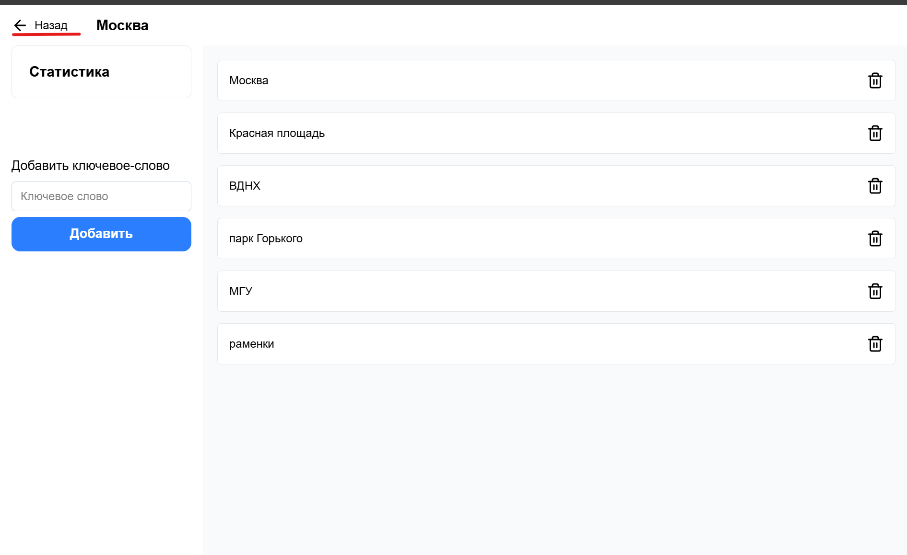

## 7. Вкладка «Стоп-слова»

### Боковая панель: статистика

Раздел «Категорий стоп-слов» показывает, сколько у вас категорий для стоп-слов.

Раздел «Всего стоп-слов» показывает общее количество слов и фраз во всех категориях.

### Нижний блок: создание новой категории

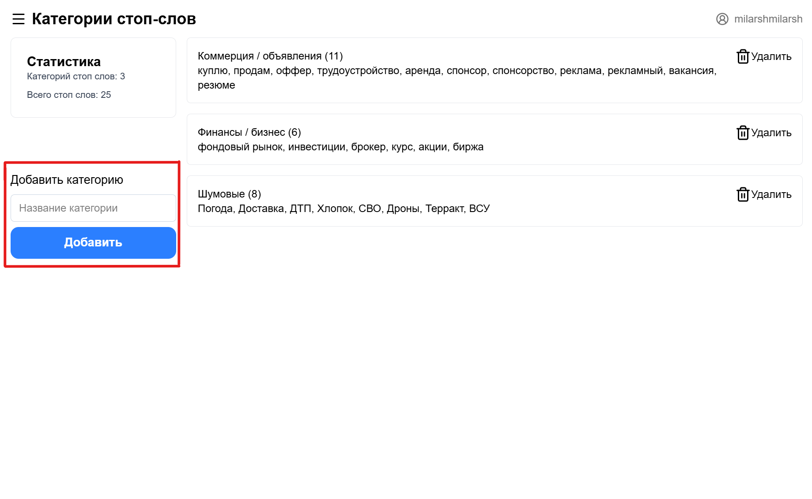

- Поле «Название категории» — для ввода имени новой группы стоп-слов.
- Кнопка «Добавить» — создаёт новую пустую категорию с введённым названием.

### Центральная панель

Содержит ленту со всеми категориями стоп-слов.

Каждый виджет категории содержит название категории. В скобках указано количество стоп-слов внутри неё. Под названием через запятую перечислены сами стоп-слова этой категории.

Рядом со списком слов находится кнопка «Удалить» — она удаляет всю категорию целиком.

Для перехода на страницу категории стоп-слов нажмите на название нужной категории.

### Отдельная вкладка категории стоп-слов

#### Боковая панель

Статистика содержит количество стоп-слов в данной категории.

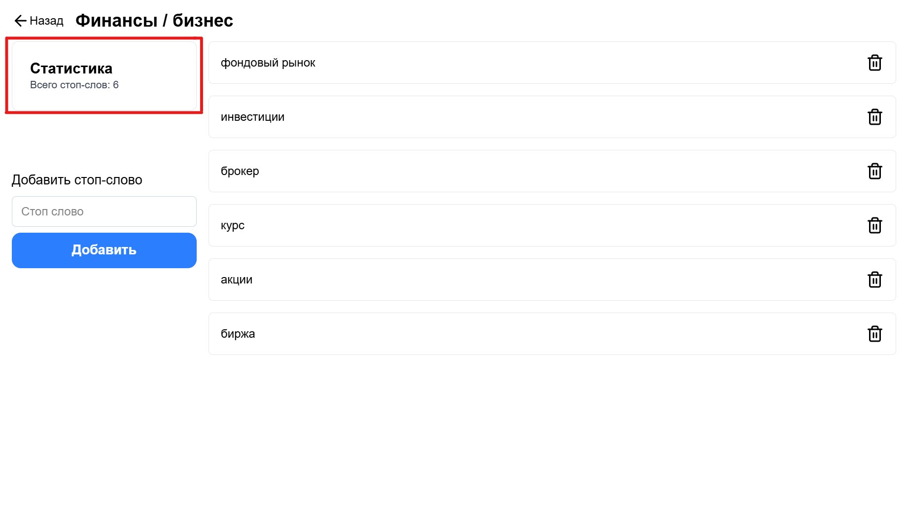

#### Нижний блок: добавление нового стоп-слова

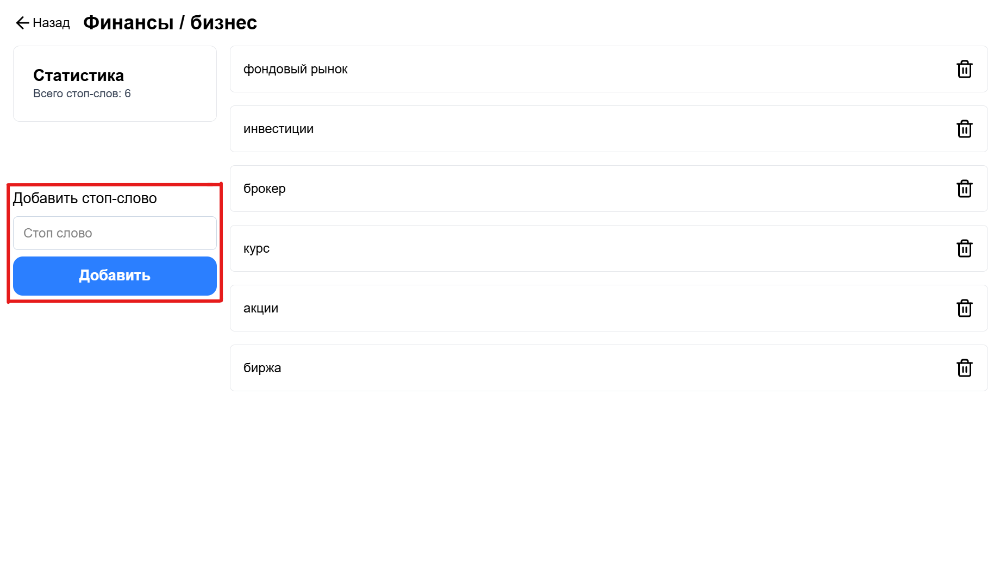

- Поле «Стоп-слово» — для ввода нового слова.
- Кнопка «Добавить» — добавляет в данную категорию новое слово.

#### Центральная панель

Содержит ленту со всеми стоп-словами.

Напротив имени каждого стоп-слова есть кнопка для удаления этого слова.

Для возвращения на вкладку «Ключевые слова» нажмите кнопку «Назад», расположенную слева на верхней панели.

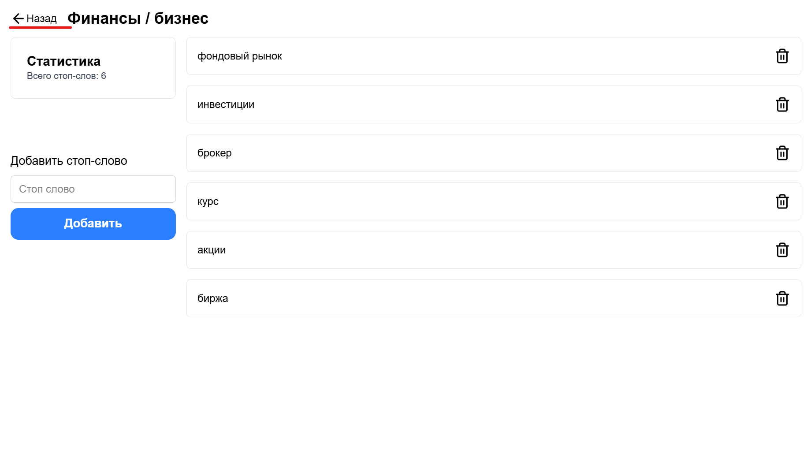

## 8. Вкладка «Управление источниками»

Основная панель содержит ленту со всеми источниками. Виджет каждого источника содержит название источника, количество новостей этого источника и кнопку для удаления этого источника.

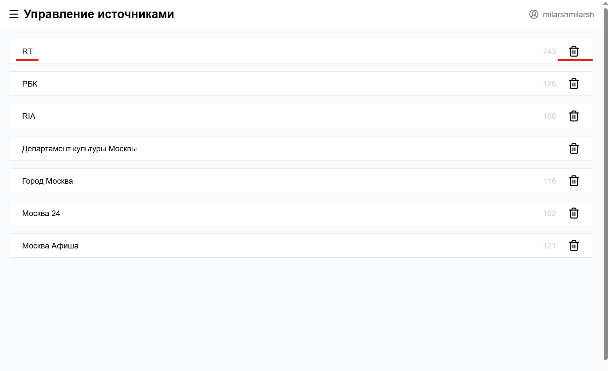

## 9. Вкладка личного профиля пользователя

На основной панели расположены имя пользователя и e-mail, привязанный к аккаунту. Чтобы выйти из аккаунта, нажмите кнопку «Выйти из аккаунта».

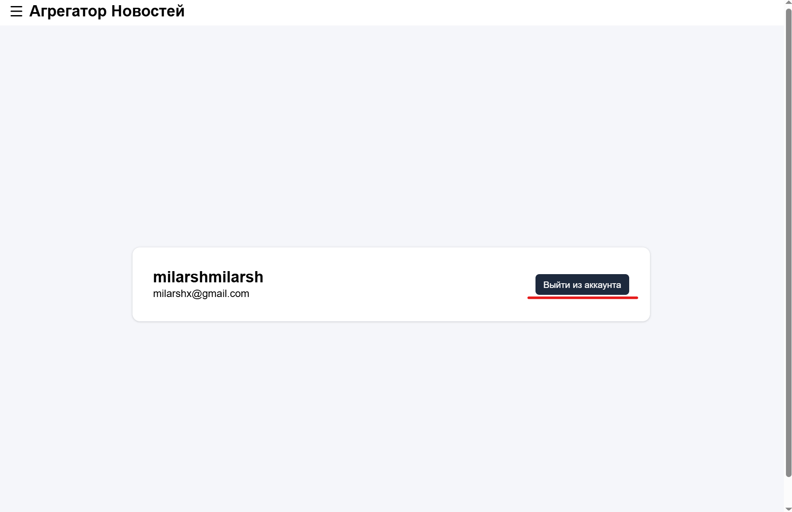